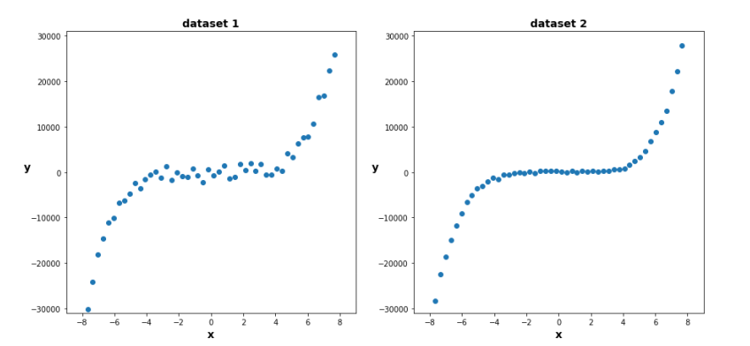
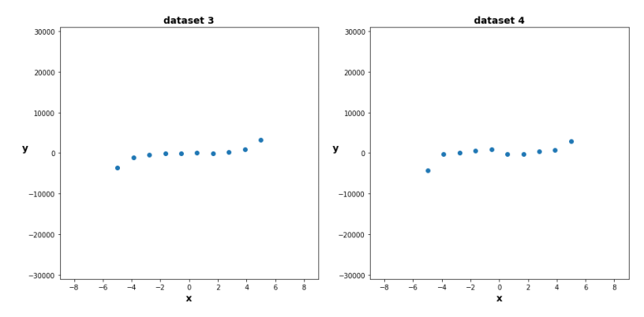
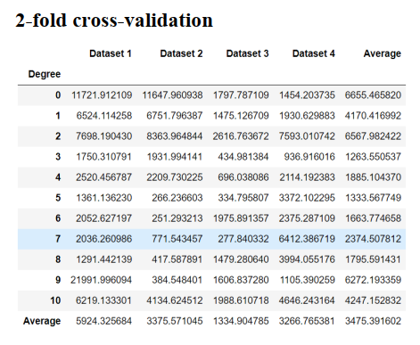
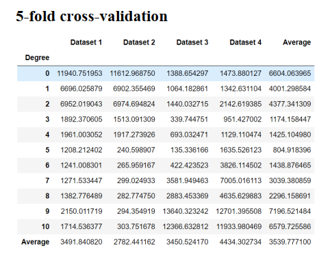
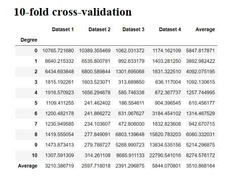
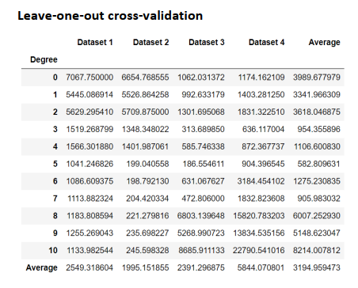

### :dart:Approximating the best polynomial curve for all data sets using the *k-fold cross validation* method
---

#### calculate *RMSE* by apply k-fold cross validation methode for _K= 2, 5, 10, N_ 

- plot datasets

- *Selecting larger the number of K (numbers of folds) means selecting the smaller the size of the test set and larger size of training set.*

- *The larger size of training data with suitable degree of model caused, the RMSE be minimizedd*

---

- *cause of number of samples in dataset and selecting degree for model it is obviouse that overfitthing would be happen
