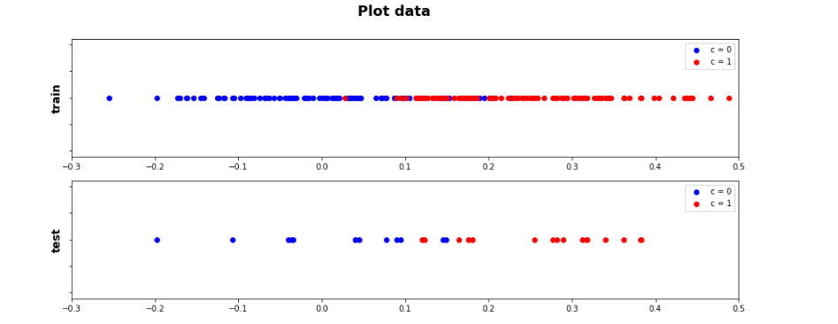
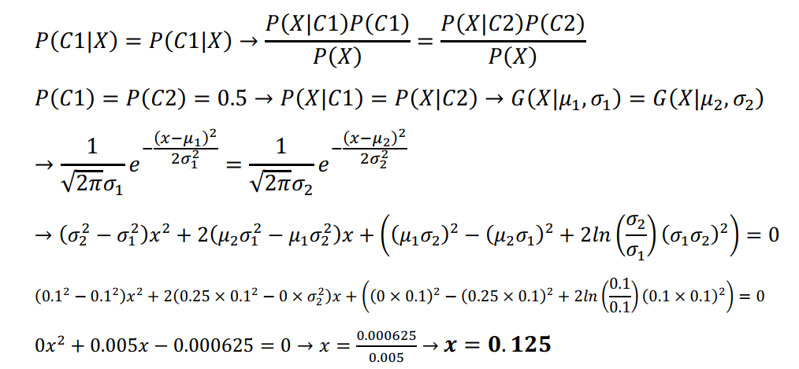
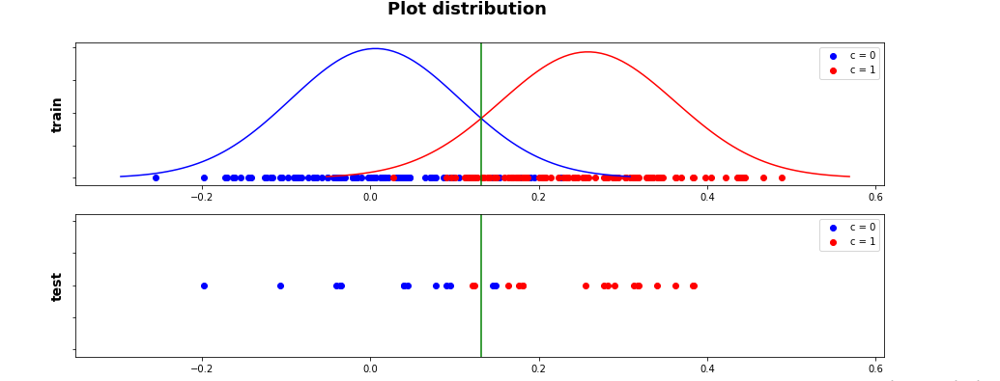

### :dart: *Calculate the decision_boundary for two class set (one_dimension)*
---

- *decision_boundary calculating*
---

- *Gaussian distribution and decision_boundary plots for two sets of data*

